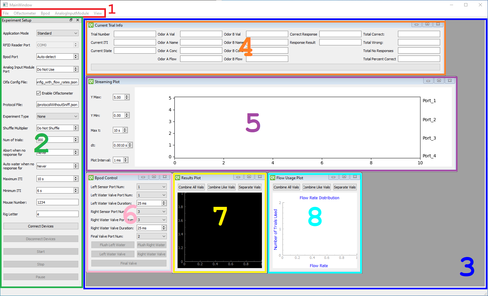
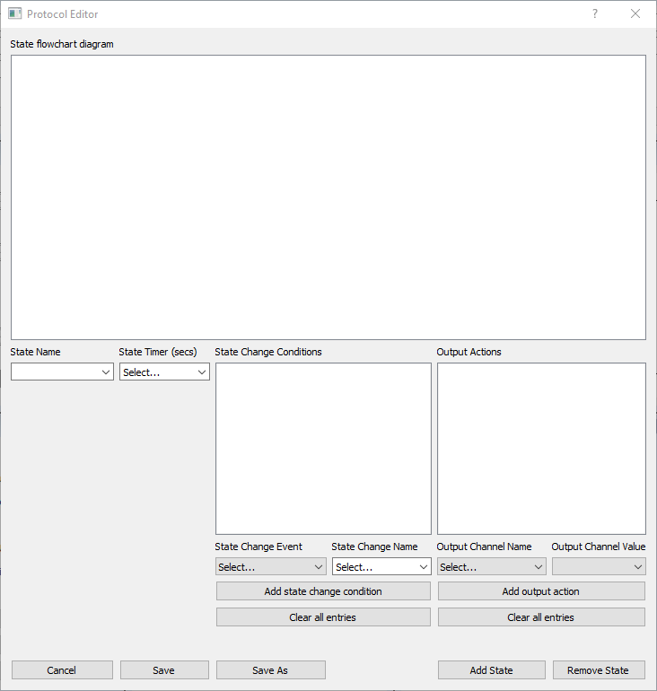
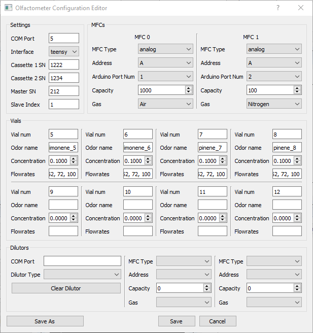
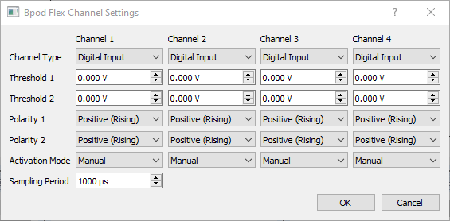
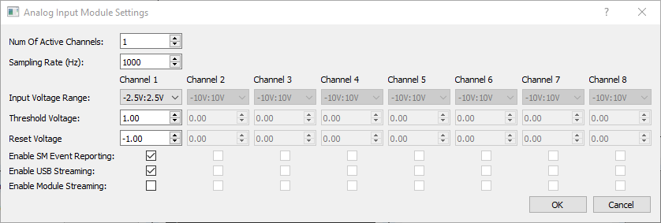
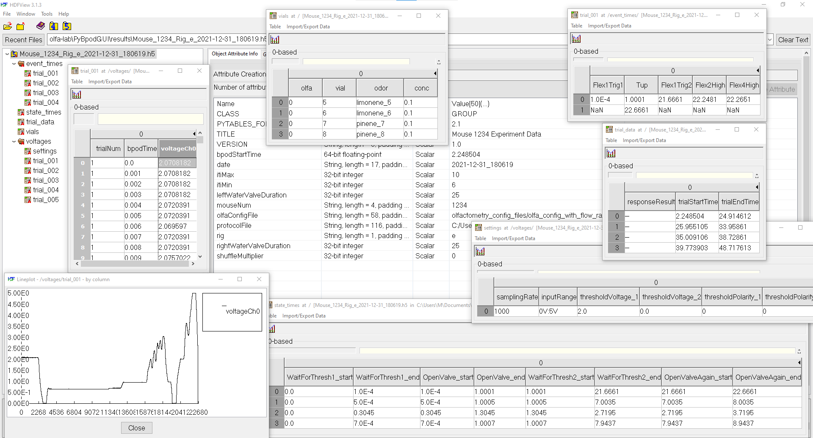

# PyBpodGUI

PyBpodGUI is a multi-threaded GUI utility to run neuroscience experiments with the _Bpod_ system by [Sanworks](https://sanworks.io/).
The GUI is written in Python using PyQt5 and connectivity to the _Bpod_ system is made possible thanks to the
[PyBpod API](https://pybpod.readthedocs.io/en/v1.8.1/) by the [Champalimaud Foundation](https://fchampalimaud.org/champalimaud-research/).
The PyBpod API is based on the _Bpod_ system's [MATLAB API](https://github.com/sanworks) by Josh Sanders of Sanworks.

## How to Install

1. Download and install Anaconda or Miniconda from the [conda website](https://docs.conda.io/projects/conda/en/latest/user-guide/install/download.html).
2. Open Anaconda Prompt or Anaconda Powershell Prompt (they can be found in a new Start Menu folder called _Anaconda3_).
3. Create a conda environment named _pybpodenv_ and install Python v3.6 with:
    ```
    conda create -n pybpodenv python=3.6
    ```
4. Activate the newly created conda environment with:
    ```
    conda activate pybpodenv
    ```
5. (Optional) Install Git if not already installed on the local system.
   ```
   conda install -c conda-forge git
   ```
6. Navigate to a desired directory in which the repositories will be cloned (e.g. create a new folder called _pybpod_):
    ```
    mkdir pybpod
    cd pybpod
    ```
7. Clone the [PyBpod API repository](https://github.com/olfa-lab/pybpod-api) into a new folder called _pybpod-api_ with:
    ```
    git clone https://github.com/olfa-lab/pybpod-api.git pybpod-api
    ```
8. Navigate into the new folder and install the PyBpod API in developer mode with (note the period at the end):
    ```
    cd pybpod-api
    pip install -e .
    ```
9. Navigate out of the _pybpod-api_ folder and clone the PyBpodGUI (this) repository into a new folder called _PyBpodGUI_ with:
    ```
    cd ..
    git clone https://github.com/olfa-lab/PyBpodGUI.git PyBpodGUI
    ```
10. Navigate into the new folder and install the following required packages with:
    ```
    cd PyBpodGUI
    pip install pyqt5-tools pyqtgraph matplotlib tables
    ```

## How to Use

### Launching the Application

In the PyBpodGUI folder, launch the GUI with:
```
python app.py
```

### Main Window Overview



1. On the top of the window there is a menu bar for several tasks and actions. 


2. On the left-hand side there is the _Experiment Setup_ dock widget with the parameters to be set before performing an
experiment.


3. On the right-hand side there is the MDI area which contains several sub-windows. They can be moved, resized, or closed,
and can be re-opened from the _View_ menu in the top menu bar.


4. The _Current Trial Info_ sub-window contains several fields that update every trial to show useful information.


5. The _Streaming Plot_ sub-window contains an animated scope-like plotter to show digital input events (like snout pokes
or licks) on each behavior port on the Bpod and analog input signals (like a sniff signal) sampled by an Analog Input
Module or the built-in ADC on the Bpod r2 Plus. It also highlights the start and end of the response window and
indicates the response result by color. There are several parameters on the left of the plot to adjust properties of the
animation and axis.


6. The _Bpod Control_ sub-window contains several parameters to specify the behavior port number of the left and right
input sensors and valves, the duration to open the left and right valves, and buttons to open and close the valves
manually.


7. The _Results Plot_ sub-window contains a line plot of the total percentage of trials which the mouse licked left
correctly for each flow rate in order to produce a sigmoid curve for odor intensity experiments. There are buttons that
combine or separate the lines of the plot based on the odor vials. For odor identity experiments, the plot becomes a
two-dimensional matrix that maps each pair of odors as a greyscale pixel on an image where the brightness represents the
percentage of trials for which the mouse licked correctly for that odor pair. The _Results Plot_ is dependent on the
_Experiment Type_ parameter in the _Experiment Setup_ dock widget on the left-hand side.


8. The _Flow Usage Plot_ sub-window contains a line plot of the number of trials that each flow rate was used. There are
buttons that combine or separate the lines of the plot based on the odor vials.

### Running a Session

1. Connect the Bpod to the PC with the USB cable and connect all the sensors, valves, or modules to their appropriate
ports on the Bpod. If using the Analog Input Module, connect it to the PC with the USB cable as well.


2. In the _Experiment Setup_ dock widget, select the application mode from the _Application Mode_ combo box. The two
options are:
   1. **Standard** -- used when performing a single session for the specified number of trials
   2. **Automatic (RFID)** -- used for autonomous 24/7 operation of RFID tagged mice where a session begins
   automatically when a mouse enters the behavioral space and continues until the mouse leaves

   Select _Standard_ for this tutorial.


3. Enter the Bpod's COM port in the _Bpod Port_ spin box. The COM port can be found in Device Manager, which can be
opened by searching for _Device Manager_ in the Start Menu. If using the Bpod r2 Plus, click the spin box down arrow 
until `Auto-detect` appears, or enter `0` as the value. This will instruct the PC to scan the available COM ports to
identify the Bpod r2 Plus because it creates three separate COM ports: a primary port for the main connection, a
secondary port for an auxiliary application, and a third port for streaming analog input data to the PC.


4. Enter the Analog Input Module's COM port in the _Analog Input Module Port_ spin box if it will be used. If not, click
the spin box down arrow until `Do Not Use` appears, or enter `0` as the value.


5. Specify an olfactometer configuration file by going to the top menu bar and clicking on **Olfactometer** > **Select
config file**. A file explorer dialog window will appear. Browse for the desired olfactometer configuration file to use
for the current session. An olfactometer configuration file is needed if an olfactometer will be used during the
session to instruct the PC how to operate the olfactometer. If the olfactometer will not be used, uncheck the
_Enable Olfactometer_ check box. Once the olfactometer configuration file is selected, its path will appear in the
_Olfa Config File_ line edit box.

   Note that the olfactometer configuration file
   must be a JSON file. There is a folder in this repository's root location called _olfactometry_config_files_ that the
   file explorer dialog window browses by default. Refer to the olfactometer configuration file that is included in this
   repository for the JSON structure. This folder can be used to hold all olfactometer configuration files and is where
   the built-in editor saves new files to. It is recommended to use the built-in editor to modify or create new
   olfactometer configuration files. Instructions can be found below.


6. Specify a protocol file by going to the top menu bar and clicking on **File** > **Open Protocol**. A file explorer
dialog window will appear. Browse for the desired protocol file to use for the current session. A protocol file is
needed to instruct the Bpod how to build the state machine. Once the protocol file is selected, its path will appear in
the _Protocol File_ line edit box.

   Note that the protocol file must be a JSON file. There is a
   folder in this repository's root location called _protocol_files_ that the file explorer dialog windows browses by
   default. Refer to the protocol files that are included in this repository for the JSON structure. This folder can be
   used to hold all protocol files and is where the built-in editor saves new files to. It is recommended to use the
   built-in editor to modify or create new protocol files. Instructions can be found below.


7. Select the experiment type in the _Experiment Type_ combo box. This instructs the PC on how to generate the
olfactometer stimulus/stimuli for each trial which will determine the correct response (left or right). It also
instructs the PC on how to display results. The three options are:
   1. **None** -- for experiments that do not need to generate a new stimulus/stimuli each trial, such as with lick training
   2. **Intensity** -- for experiments where odor intensity determines the correct response (depending on MFC flowrate value)
   3. **Identity** -- for experiments where odor equality determines the correct response (depending on odor name)


8. Enter a value in the _Shuffle Multiplier_ spin box. This value is used when parsing the olfactometer configuration
file to determine how many times to copy and extend the lists of vial numbers and flowrates before shuffling them. The
greater the value, the more random the vials and flowrates will be presented. For example, if the _Shuffle Multiplier_
is set to `3` and the olfactometer configuration file contains four vials resulting in the vial numbers list
`['5', '6', '7', '8']`, the list will be copied and extended `3` times resulting in
   ```
   ['5', '6', '7', '8', '5', '6', '7', '8', '5', '6', '7', '8']
   ```
   and then shuffled
   ```
   ['6', '7', '5', '6', '5', '5', '6', '8', '7', '7', '8', '8']
   ```
   which will then be iterated through with each trial. Once the iteration through the entire list is complete, it will
   be re-shuffled and the iteration resets from the beginning. This processes of copying and extending and then
   shuffling also applies to the list of flowrates obtained when parsing the olfactometer configuration file. Note that
   increasing the _Shuffle Multiplier_ also increases the probability of consecutive repetitions.

   Set the _Shuffle Multiplier_ value to `1` to avoid consecutive repetitions. This will not copy and extend the lists
   of vial numbers and flowrates but instead will only shuffle and iterate through them and re-shuffle when iteration is
   complete to start from the beginning.

   Set the _Shuffle Multiplier_ value to `0` to prevent shuffling, or click the spin box down arrow until
   `Do Not Shuffle` appears. This will neither copy and extend the lists of vial numbers and flowrates nor shuffle them,
   but instead will only iterate through them with each trial in the order they are written in the olfactometer
   configuration file and repeat from the beginning when iteration completes.


9. Enter the number of trials to run during the session in the _Number of Trials_ spin box.


10. Enter the number of consecutive "No Response" trials after which the PC should abort the session in the _Abort when
no response for_ spin box. To disable aborting, click the spin box down arrow until `Never` appears or enter `0` as the
value.


11. Enter the number of consecutive "No Response" trials after which the Bpod should automatically open the water valves
to "re-motivate" the mouse in the _Auto water when no response for_ spin box. The left and right water valves will open
for one second. To disable automatic watering, click the spin box down arrow until `Never` appears or enter `0` as the
value.


12. Enter the upper bound for the Inter-Trial Interval (ITI) range in the _Maximum ITI_ spin box. The ITI is the
duration in between the end of a trial and the start of the next trial in seconds (and there is actually one additional
second used by the PC always). The PC randomly selects an ITI with each trial from the given range. To disable random
selection and set a fixed ITI to use every trial, enter the same ITI value for the upper and lower bounds, i.e. the
_Maximum ITI_ and _Minimum ITI_ spin boxes.


13. Enter the lower bound for the Inter-Trial Interval (ITI) range in the _Minimum ITI_ spin box. The ITI is the
duration in between the end of a trial and the start of the next trial in seconds (and there is actually one additional
second used by the PC always). The PC randomly selects an ITI with each trial from the given range. To disable random
selection and set a fixed ITI to use every trial, enter the same ITI value for the lower and upper bounds, i.e. the
_Minimum ITI_ and _Maximum ITI_ spin boxes.


14. Enter a mouse identifier in the _Mouse ID_ line edit box. This identifier is used when saving the session data file.


15. Enter a rig identifier in the _Rig ID_ line edit box. This identifier is used when saving the session data file.


16. Click the _Connect Devices_ push button to connect to the Bpod and, if applicable, the Analog Input Module. It may
take a few seconds for the PC to auto-detect the Bpod r2 Plus. Once connected, the _Connect Devices_ push button will
say `Connected` and become greyed-out and disabled, while the _Disconnect Devices_ and _Start_ push buttons will become
enabled (not greyed-out). The push buttons in the _Bpod Control_ subwindow will also become enabled.


17. In the _Bpod Control_ subwindow, select the port numbers (on the Bpod) and valve open durations for the left and
right sensors and water valves, and the port number for the final valve. Flush out the air from the left and right water
lines if necessary by clicking on the _Flush Left Water_ and _Flush Right Water_ push buttons. This will open a small
dialog window with a progress bar until the operation completes. The operation opens and closes the respective water
valve 100 times, where the open and close durations are each equal to the durations given in the _Left Water Valve
Duration_ and _Right Water Valve Duration_ spin boxes, in milliseconds.


18. Click the _Start_ push button to start the session. The _Current Trial Info_ subwindow should become populated and
the _Streaming Plot_ subwindow should animate the input signals (e.g. sniff signal, lick detections). After the first
trial completes, the _Results Plot_ subwindow should update, as well as the _Flow Usage Plot_ if applicable.

### Creating a New Protocol

A protocol file defines the state machine that will be sent to the Bpod to instruct it on what to do. The state machine
can be thought of being like a flowchart that checks for different conditions but the "flow" of operation takes only
one path from start to end. A state contains four attributes: a name, a timer duration, another state to transition to
after a condition is met, and an optional output action. The protocol file is saved in the JSON file format for easy
readability and gets parsed when running a session. It can be written with a text editor by following the required
structure as can be found in one of the example protocol files, or it can be created by the GUI's built-in protocol
editor. To use the built-in protocol editor:

1. Connect a Bpod to the PC first and enter its COM port (or select `Auto-detect` if it is a Bpod r2 Plus) in the
_Experiment Setup_ dock widget on the left side of the main window. This is so that the PC can read all the available
input and output channels from the Bpod and display them in the built-in protocol editor. Click the **Connect Devices**
push button.


2. From the top menu bar, click **File** > **New Protocol**. The protocol editor will open in a new window. Note that if
a protocol file was already selected before launching the protocol editor, the protocol editor will read the selected
protocol file and display the states and contents in the diagram area.



3. It may be helpful to draw the state machine as a flowchart before creating it in the protocol editor. Beginning with
the first state, enter the state name in the _State Name_ combo box. The combo box is editable and will hold the state
names used for previous states for convenience.


4. Enter the state timer value in the _State Timer_ combo box. The combo box is editable and will hold keywords that the
PC will use as variables for when the state timer value changes every trial. Those keywords are:

   - **rewardDuration** -- used for the "reward" state to reward the mouse with water after responding correctly in a
      trial. It is a variable whose value represents the duration of the reward state, which is just the duration to
      keep the water valve open and is set by the _Left Water Valve Duration_ and _Right Water Valve Duration_ spin
      boxes from the _Bpod Control_ subwindow. This variable is needed because the left and right water valve durations
      may not be equal, and because the correct response changes every trial so this variable is updated at the start of
      every trial depending on the correct response.
   
   - **itiDuration** -- used for the ITI state at the end of every trial. It is a variable whose value represents the
   ITI duration and is set by the range of the _Min ITI_ and _Max ITI_ spin boxes in the _Experiment Setup_ dock 
   widget. This variable is needed for when the ITI duration changes every trial and is updated at the start of every
   trial.
   
   Use the keywords for the applicable states. Otherwise, enter a numeric value for the desired state timer or enter `0`
   for infinite duration. Note that the state timer will only take effect (i.e. transition to the next state after the
   elapsed duration) if the "Tup" condition is used in the state's change conditions, as explained below.


5. Add the state change conditions by selecting an event from the _State Change Event_ combo box and then enter the
   name of the state to transition to when the event occurs in the _State Change Name_ combo box, or select one of the
   reserved names. The reserved names are used as variables by the PC for transitions that change every trial and for
   indicating response results. They are:
   - **WaitForResponse** -- used for the state that checks for the response after presenting the stimulus and 
      transitions to the response state (e.g. reward, punish, etc.) depending on the event occurrence. The PC uses this
      state to indicate the start of the response window, which is animated in the _Streaming Plot_ subwindow.
   
   - **leftAction** -- used as a variable by the PC and gets replaced by the name of the response state depending on
      the correct response of the trial. It is used in conjunction with the "WaitForResponse" state as the name of the
      transition state in the state change conditions. For example, if the correct response for a trial is left, then
      the PC will replace "leftAction" with "Correct" and "rightAction" with "Wrong" before sending the state machine
      to the Bpod. The opposite applies if the correct response for a trial is right.
   
   - **rightAction** -- used as a variable by the PC and gets replaced by the name of the response state depending on
      the correct response of the trial. It is used in conjunction with the "WaitForResponse" state as the name of the
      transition state in the state change conditions. For example, if the correct response for a trial is right, then
      the PC will replace "rightAction" with "Correct" and "leftAction" with "Wrong" before sending the state machine
      to the Bpod. The opposite applies if the correct response for a trial is left.
   
   - **Correct** -- used to indicate when the mouse responds correctly, and signals to the _Streaming Plot_ to end the
      response window animation and change its color to green.
   
   - **Wrong** -- used to indicate when the mouse responds incorrectly, and signals to the _Streaming Plot_ to end the
      response window animation and change its color to red.
   
   - **NoResponse** -- used to indicate when the mouse does not respond within the response window, and signals to the
      _Streaming Plot_ to end the response window animation.
   
   - **NoSniff** -- used to indicate when the sniff sensor does not detect a threshold crossing and can be used as a
      cutoff for ending the trial instead of waiting forever for the sniff.
   
   - **ITI** -- used to indicate the ITI state in conjunction with the "itiDuration" variable.
   
   - **exit** -- used to signal the Bpod to exit the state machine, which signals the end of a trial.

   After selecting the state change event and entering the associated state change name, click the _Add state change
   condition_ push button. The state change condition will be listed in the _State Change Conditions_ list widget box.
   Continue adding all of the desired state change conditions for the current state. If an error was made, click on the
   _Clear all entries_ push button to remove all the added state change conditions for the current state and start over.


6. Add an output action for the current state by selecting an output channel from the _Output Channel Name_ combo box.
Then select the output value from the _Output Channel Value_ combo box. Then click on the _Add output action_ push
button. The output action will be listed in the _Output Actions_ list widget box. Continue adding all of the desired
output actions for the current state. If an error was made, click on the _Clear all entries_ push button to remove all
the added output actions for the current state and start over. Note that an output action is not required.


7. After verifying all parameters, click the _Add State_ push button on the bottom. The state will appear as a graphic
item in the flowchart diagram area and will show the defined parameters. If an error was made, click on the _Remove
State_ push button on the bottom to remove the last state added.


8. Repeat the process for defining and adding the next state(s), which will be in the state change conditions of the
previous state.


9. When all states have been added, click the _Save As_ button to save the protocol as a new file. The _Save_ button is
used to save an existing file. The _Save As New Protocol File_ explorer window will appear. Select the location to save
the file to, which is in the _protocol_files_ folder in the root of this repository by default. Name the file and click
the _Save_ button to close the windows.


### Creating a New Olfactometer Configuration

An olfactometer configuration file defines the settings and contents of the olfactometer, such as the MFC parameters,
odor vials to use, and their flowrates. The file is JSON format for easy readability. The PC chooses the odor and
flowrate for each trial based on the vials and flowrates information contained in this file. An olfactometer 
configuration file must only define the settings and odor vials that will be used when it is loaded during a session.
To create or edit an olfactometer configuration file using the GUI's built-in editor:

1. From the top menu bar, click on **Olfactometer** > **Configure settings**. The editor window will appear.

   


2. Enter the olfactometer's COM port in the the _COM Port_ line edit box.


3. Select the interface in the _Interface_ combo box. Currently, the only interface is `teensy`.


4. Enter the serial number for Cassette 1 in the _Cassette 1 SN_ line edit box.


5. Enter the serial number for Cassette 2 in the _Cassette 2 SN_ line edit box.


6. Enter the master serial number in the _Master SN_ line edit box.


7. Enter the slave index number in the _Slave Index_ line edit box.


8. Select the MFC type of MFC 0 and MFC 1 from the respective _MFC Type_ combo box.


9. Select the MFC address of MFC 0 and MFC 1 from the respective _Address_ combo box.


10. Select the Arduino port number of MFC 0 and MFC 1 from the respective _Arduino Port Num_ combo box.


11. Enter the MFC capacity of MFC 0 and MFC 1 in the respective _Capacity_ spin box.


12. Select the MFC gas type of MFC 0 and MFC 1 from the respective _Gas_ combo box.


13. Enter the details of each odor vial in the _Vials_ section. Ensure that the vial number matches the physical
position in the olfactometer. Only enter details of odor vials that will be used in the olfactometer during the session
with which this olfactometer configuration file will be loaded. Unused positions in the olfactometer must be left blank
and zeroed in the file.
    - Odor vials cannot have the same name in the _Odor name_ line edit box. To use more than one odor vial containing
    the same odor name, differentiate between them by appending the vial number to the name.
    
    - Multiple flowrates can be listed for each odor vial by separating them with commas. They do not need to be sorted,
    but keep in mind that if shuffling is disabled, the PC will iterate through them in the oder they are listed. Vials
    can each have different flowrates listed and of different lengths. The flowrate represents the value for MFC 1 and
    can range from 1 to the capacity of MFC 1.


14. Enter the details of the dilutor if applicable.


15. Click the _Save_ pushbutton to save to the existing file, or the _Save As_ pushbutton to create a new file. A file
explorer dialog window will appear. Enter a name for the file and click _Save_ to finish.


### Configuring Bpod Flex Channels

The Bpod r2 Plus features four _Flex Channels_ that can each be configured independently as digital input, digital
output, analog input, or analog output. The Flex Channels must be configured before running a session. To configure the
Flex Channels:

1. From the top menu bar, click on **Bpod** > **Configure Flex Channels**. The configuration window will appear.
   
   

2. Select the desired channel type of each flex channel from the _Channel Type_ combo box of the respective channel
column.

3. Enter the threshold voltage that will trigger an event upon crossing in the _Threshold 1_ double spin box of the
respective channel column.

4. (Optional) Enter a second threshold voltage that will trigger another separate event upon crossing in the
_Threshold 2_ double spin box of the respective channel column.

5. Select the crossing polarity of the first threshold from the _Polarity 1_ combo box of the respective channel column.
This defines the slope direction of the first threshold crossing.

6. (Optional) Select a crossing polarity of the second threshold from the _Polarity 2_ combo box of the respective
channel column. This defines the slope direction of the second threshold crossing.

7. Select the threshold activation mode from the _Activation Mode_ combo box of the respective channel column. The
options are:
   - **Manual** -- thresholds inactivate when crossed and must be re-enabled by the state machine.
   
   - **Automatic** -- the two thresholds inactivate, but activate each other (so crossing 1 disables 1 and activates 2,
   while crossing 2 disables 2 and activates 1). This mode can be used to generate a pair of events for each sniff.

8. Enter the sampling period to use for all analog input channels in the _Sampling Period_ spin box.

9. Click the _OK_ button to finish. The Bpod flex channels will be changed to the new settings.


### Configuring Analog Input Module Settings

If using the separate Analog Input Module with the Bpod, the settings must be configured before running a session. To
configure the Analog Input Module Settings:

1. From the top menu bar, click on **AnalogInputModule** > **Configure settings**. The configuration window will appear.
   


2. Enter the number of channels on the Analog Input Module that will be used in the _Num Of Active Channels_ spin box.


3. Enter the sampling rate to use for all channels in the _Sampling Rate (Hz)_ spin box.


4. Select the input voltage range from the _Input Voltage Range_ combo box of the respective channel column.


5. Enter the threshold voltage that will trigger an event upon crossing in the _Threshold Voltage_ double spin box of
the respective channel column.


6. Enter the reset voltage to be crossed before triggering an event again for the threshold voltage crossing in the
_Reset Voltage_ double spin box of the respective channel column.


7. Enable or disable event reporting to the state machine using the _Enable SM Event Reporting_ check box of the
respective channel column. This must be enabled in order for the Analog Input Module to send a signal to the Bpod of the
threshold crossing event.


8. Enable or disable analog data streaming to the PC using the _Enable USB Streaming_ check box of the respective
channel column. This must be enabled to view the analog data in the _Streaming Plot_ subwindow and to save the analog
data to the .h5 file created with every session.


9. Enable or disable analog data streaming to another module connected to the Analog Input Module using the _Enable
Module Streaming_ check box of the respective channel column.


10. Click the _OK_ button to finish. The Analog Input Module's settings will be updated to the new settings.


### Viewing Saved Data

Results of every session are saved in an HDF5 file (.h5 extension) in the `results/` folder within location where the
repository was cloned to on the local system. It is automatically created when running a session for the first time.
The results files can be viewed with the [HDF5View](https://www.hdfgroup.org/downloads/hdfview) application. Data is
saved using [PyTables](https://www.pytables.org/) and is organized in tables, and similar tables are organized in
groups.


