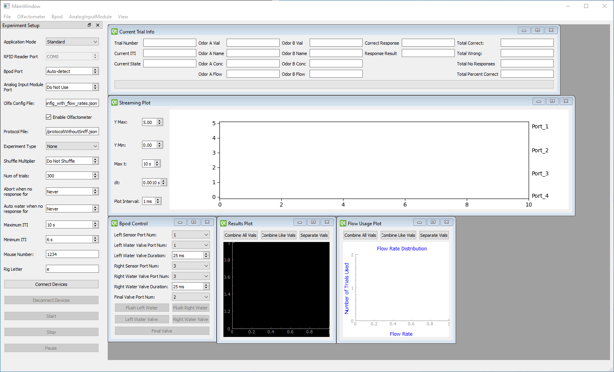

# PyBpodGUI

PyBpodGUI is a GUI utility to run neuroscience experiments with the _Bpod_ system by [Sanworks](https://sanworks.io/).
The GUI is written in Python using PyQt5 and connectivity to the _Bpod_ system is made possible thanks to the
[PyBpod API](https://pybpod.readthedocs.io/en/v1.8.1/) by the [Champalimaud Foundation](https://fchampalimaud.org/champalimaud-research/).
The PyBpod API is based on the _Bpod_ system's [MATLAB API](https://github.com/sanworks) by Josh Sanders of Sanworks.

## How to Install

1. Download and install Anaconda or Miniconda from the [conda website](https://docs.conda.io/projects/conda/en/latest/user-guide/install/download.html).
2. Open Anaconda Prompt or Anaconda Powershell Prompt (they can be found in a new Start Menu folder called _Anaconda3_).
3. Create a conda environment named _pybpodenv_ and install Git and Python v3.6 with:
    ```
    conda create -n pybpodenv git python=3.6
    ```
4. Activate the newly created conda environment with:
    ```
    conda activate pybpodenv
    ```
5. Navigate to a desired directory in which the repositories will be cloned (e.g. create a new folder called _pybpod_):
    ```
    mkdir pybpod
    cd pybpod
    ```
6. Clone the [PyBpod API repository](https://github.com/olfa-lab/pybpod-api) into a new folder called _pybpod-api_ with:
    ```
    git clone https://github.com/olfa-lab/pybpod-api.git pybpod-api
    ```
7. Navigate into the new folder and install the PyBpod API in developer mode with (note the period at the end):
    ```
    cd pybpod-api
    pip install -e .
    ```
8. Navigate out of the _pybpod-api_ folder and clone the PyBpodGUI (this) repository into a new folder called _PyBpodGUI_ with:
    ```
    cd ..
    git clone https://github.com/olfa-lab/PyBpodGUI.git PyBpodGUI
    ```
9. Navigate into the new folder and install the following required packages with:
   ```
   cd PyBpodGUI
   pip install pyqt5-tools pyqtgraph matplotlib tables
   ```

## How to Use

### Launching the Application

In the PyBpodGUI folder, launch the GUI with:
```
python app.py
```



### Window Overview

On the top of the window there is a menu bar for several tasks and actions.
On the left-hand side there is the _Experiment Setup_ dock widget with the parameters to be set before performing an
experiment.
On the right-hand side there is the MDI area which contains several sub-windows. They can be moved, resized, or closed,
and can be re-opened from the _View_ menu in the top menu bar.

The _Current Trial Info_ sub-window contains several fields that update every trial to show useful information.

The _Streaming Plot_ sub-window contains an animated scope-like plotter to show digital input events (like snout pokes
or licks) on each behavior port on the Bpod and analog input signals (like a sniff signal) sampled by an Analog Input
Module or the built-in ADC on the Bpod r2 Plus. It also highlights the start and end of the response window and
indicates the response result by color. There are several parameters on the left of the plot to adjust properties of the
animation and axis.

The _Bpod Control_ sub-window contains several parameters to specify the behavior port number of the left and right
input sensors and valves, the duration to open the left and right valves, and buttons to open and close the valves
manually.

The _Results Plot_ sub-window contains a line plot of the total percentage of trials which the mouse licked left
correctly for each flow rate in order to produce a sigmoid curve for odor intensity experiments. There are buttons that
combine or separate the lines of the plot based on the odor vials. For odor identity experiments, the plot becomes a
two-dimensional matrix that maps each pair of odors as a greyscale pixel on an image where the brightness represents the
percentage of trials for which the mouse licked correctly for that odor pair. The _Results Plot_ is dependent on the
_Experiment Type_ parameter in the _Experiment Setup_ dock widget on the left-hand side.

The _Flow Usage Plot_ sub-window contains a line plot of the number of trials that each flow rate was used. There are
buttons that combine or separate the lines of the plot based on the odor vials.

